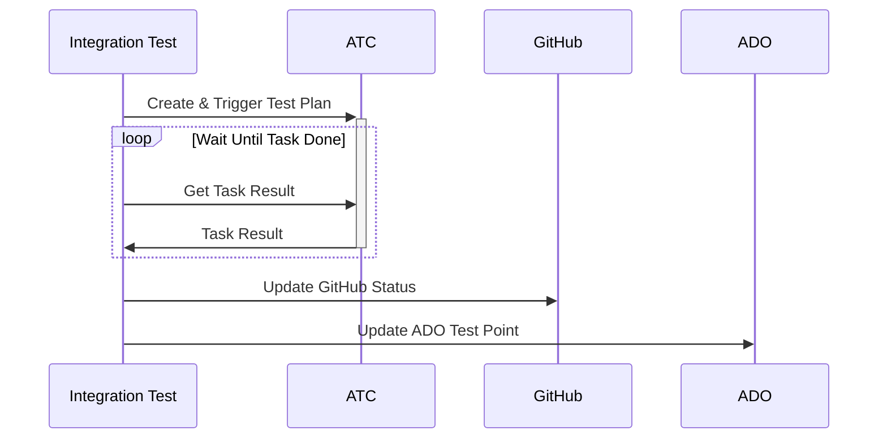
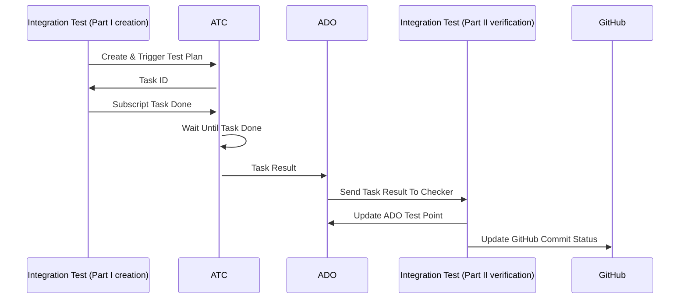

[](https://github.com/dependabot)
[](https://github.com/psf/black)
[](https://github.com/charliermarsh/ruff)

<!-- Pytest Coverage Comment:Begin -->

<a href="https://github.com/BPSVCommonService/Action-ExecutorTemplate/blob/undefined/README.md"></a><details><summary>Coverage Report </summary><table><tr><th>File</th><th>Stmts</th><th>Miss</th><th>Cover</th><th>Missing</th></tr><tbody><tr><td colspan="5"><b>src/app</b></td></tr><tr><td>&nbsp; &nbsp;<a href="https://github.com/BPSVCommonService/Action-ExecutorTemplate/blob/undefined/src/app/__init__.py">**init**.py</a></td><td>0</td><td>0</td><td>100%</td><td>&nbsp;</td></tr><tr><td>&nbsp; &nbsp;<a href="https://github.com/BPSVCommonService/Action-ExecutorTemplate/blob/undefined/src/app/config.py">config.py</a></td><td>23</td><td>0</td><td>100%</td><td>&nbsp;</td></tr><tr><td>&nbsp; &nbsp;<a href="https://github.com/BPSVCommonService/Action-ExecutorTemplate/blob/undefined/src/app/description.py">description.py</a></td><td>6</td><td>0</td><td>100%</td><td>&nbsp;</td></tr><tr><td>&nbsp; &nbsp;<a href="https://github.com/BPSVCommonService/Action-ExecutorTemplate/blob/undefined/src/app/main.py">main.py</a></td><td>15</td><td>0</td><td>100%</td><td>&nbsp;</td></tr><tr><td colspan="5"><b>src/app/action</b></td></tr><tr><td>&nbsp; &nbsp;<a href="https://github.com/BPSVCommonService/Action-ExecutorTemplate/blob/undefined/src/app/action/__init__.py">**init**.py</a></td><td>0</td><td>0</td><td>100%</td><td>&nbsp;</td></tr><tr><td>&nbsp; &nbsp;<a href="https://github.com/BPSVCommonService/Action-ExecutorTemplate/blob/undefined/src/app/action/executor.py">executor.py</a></td><td>90</td><td>61</td><td>32%</td><td><a href="https://github.com/BPSVCommonService/Action-ExecutorTemplate/blob/undefined/src/app/action/executor.py#L37-L38">37&ndash;38</a>, <a href="https://github.com/BPSVCommonService/Action-ExecutorTemplate/blob/undefined/src/app/action/executor.py#L40-L47">40&ndash;47</a>, <a href="https://github.com/BPSVCommonService/Action-ExecutorTemplate/blob/undefined/src/app/action/executor.py#L52-L57">52&ndash;57</a>, <a href="https://github.com/BPSVCommonService/Action-ExecutorTemplate/blob/undefined/src/app/action/executor.py#L62">62</a>, <a href="https://github.com/BPSVCommonService/Action-ExecutorTemplate/blob/undefined/src/app/action/executor.py#L66-L70">66&ndash;70</a>, <a href="https://github.com/BPSVCommonService/Action-ExecutorTemplate/blob/undefined/src/app/action/executor.py#L74-L75">74&ndash;75</a>, <a href="https://github.com/BPSVCommonService/Action-ExecutorTemplate/blob/undefined/src/app/action/executor.py#L79">79</a>, <a href="https://github.com/BPSVCommonService/Action-ExecutorTemplate/blob/undefined/src/app/action/executor.py#L83-L85">83&ndash;85</a>, <a href="https://github.com/BPSVCommonService/Action-ExecutorTemplate/blob/undefined/src/app/action/executor.py#L87">87</a>, <a href="https://github.com/BPSVCommonService/Action-ExecutorTemplate/blob/undefined/src/app/action/executor.py#L89-L91">89&ndash;91</a>, <a href="https://github.com/BPSVCommonService/Action-ExecutorTemplate/blob/undefined/src/app/action/executor.py#L94">94</a>, <a href="https://github.com/BPSVCommonService/Action-ExecutorTemplate/blob/undefined/src/app/action/executor.py#L99">99</a>, <a href="https://github.com/BPSVCommonService/Action-ExecutorTemplate/blob/undefined/src/app/action/executor.py#L106-L107">106&ndash;107</a>, <a href="https://github.com/BPSVCommonService/Action-ExecutorTemplate/blob/undefined/src/app/action/executor.py#L109">109</a>, <a href="https://github.com/BPSVCommonService/Action-ExecutorTemplate/blob/undefined/src/app/action/executor.py#L114">114</a>, <a href="https://github.com/BPSVCommonService/Action-ExecutorTemplate/blob/undefined/src/app/action/executor.py#L116">116</a>, <a href="https://github.com/BPSVCommonService/Action-ExecutorTemplate/blob/undefined/src/app/action/executor.py#L204-L205">204&ndash;205</a>, <a href="https://github.com/BPSVCommonService/Action-ExecutorTemplate/blob/undefined/src/app/action/executor.py#L215">215</a>, <a href="https://github.com/BPSVCommonService/Action-ExecutorTemplate/blob/undefined/src/app/action/executor.py#L225">225</a>, <a href="https://github.com/BPSVCommonService/Action-ExecutorTemplate/blob/undefined/src/app/action/executor.py#L228-L229">228&ndash;229</a>, <a href="https://github.com/BPSVCommonService/Action-ExecutorTemplate/blob/undefined/src/app/action/executor.py#L231-L232">231&ndash;232</a>, <a href="https://github.com/BPSVCommonService/Action-ExecutorTemplate/blob/undefined/src/app/action/executor.py#L234">234</a>, <a href="https://github.com/BPSVCommonService/Action-ExecutorTemplate/blob/undefined/src/app/action/executor.py#L237-L239">237&ndash;239</a>, <a href="https://github.com/BPSVCommonService/Action-ExecutorTemplate/blob/undefined/src/app/action/executor.py#L241">241</a>, <a href="https://github.com/BPSVCommonService/Action-ExecutorTemplate/blob/undefined/src/app/action/executor.py#L244">244</a>, <a href="https://github.com/BPSVCommonService/Action-ExecutorTemplate/blob/undefined/src/app/action/executor.py#L247-L249">247&ndash;249</a>, <a href="https://github.com/BPSVCommonService/Action-ExecutorTemplate/blob/undefined/src/app/action/executor.py#L252-L253">252&ndash;253</a>, <a href="https://github.com/BPSVCommonService/Action-ExecutorTemplate/blob/undefined/src/app/action/executor.py#L255-L257">255&ndash;257</a></td></tr><tr><td>&nbsp; &nbsp;<a href="https://github.com/BPSVCommonService/Action-ExecutorTemplate/blob/undefined/src/app/action/models.py">models.py</a></td><td>60</td><td>16</td><td>73%</td><td><a href="https://github.com/BPSVCommonService/Action-ExecutorTemplate/blob/undefined/src/app/action/models.py#L83-L86">83&ndash;86</a>, <a href="https://github.com/BPSVCommonService/Action-ExecutorTemplate/blob/undefined/src/app/action/models.py#L88-L89">88&ndash;89</a>, <a href="https://github.com/BPSVCommonService/Action-ExecutorTemplate/blob/undefined/src/app/action/models.py#L91">91</a>, <a href="https://github.com/BPSVCommonService/Action-ExecutorTemplate/blob/undefined/src/app/action/models.py#L93-L94">93&ndash;94</a>, <a href="https://github.com/BPSVCommonService/Action-ExecutorTemplate/blob/undefined/src/app/action/models.py#L96-L97">96&ndash;97</a>, <a href="https://github.com/BPSVCommonService/Action-ExecutorTemplate/blob/undefined/src/app/action/models.py#L99">99</a>, <a href="https://github.com/BPSVCommonService/Action-ExecutorTemplate/blob/undefined/src/app/action/models.py#L116">116</a>, <a href="https://github.com/BPSVCommonService/Action-ExecutorTemplate/blob/undefined/src/app/action/models.py#L119-L121">119&ndash;121</a></td></tr><tr><td>&nbsp; &nbsp;<a href="https://github.com/BPSVCommonService/Action-ExecutorTemplate/blob/undefined/src/app/action/router.py">router.py</a></td><td>52</td><td>29</td><td>44%</td><td><a href="https://github.com/BPSVCommonService/Action-ExecutorTemplate/blob/undefined/src/app/action/router.py#L26-L27">26&ndash;27</a>, <a href="https://github.com/BPSVCommonService/Action-ExecutorTemplate/blob/undefined/src/app/action/router.py#L29-L31">29&ndash;31</a>, <a href="https://github.com/BPSVCommonService/Action-ExecutorTemplate/blob/undefined/src/app/action/router.py#L37-L40">37&ndash;40</a>, <a href="https://github.com/BPSVCommonService/Action-ExecutorTemplate/blob/undefined/src/app/action/router.py#L49-L52">49&ndash;52</a>, <a href="https://github.com/BPSVCommonService/Action-ExecutorTemplate/blob/undefined/src/app/action/router.py#L61-L64">61&ndash;64</a>, <a href="https://github.com/BPSVCommonService/Action-ExecutorTemplate/blob/undefined/src/app/action/router.py#L73-L74">73&ndash;74</a>, <a href="https://github.com/BPSVCommonService/Action-ExecutorTemplate/blob/undefined/src/app/action/router.py#L76-L80">76&ndash;80</a>, <a href="https://github.com/BPSVCommonService/Action-ExecutorTemplate/blob/undefined/src/app/action/router.py#L82">82</a>, <a href="https://github.com/BPSVCommonService/Action-ExecutorTemplate/blob/undefined/src/app/action/router.py#L84-L85">84&ndash;85</a>, <a href="https://github.com/BPSVCommonService/Action-ExecutorTemplate/blob/undefined/src/app/action/router.py#L87-L88">87&ndash;88</a></td></tr><tr><td colspan="5"><b>src/app/debug</b></td></tr><tr><td>&nbsp; &nbsp;<a href="https://github.com/BPSVCommonService/Action-ExecutorTemplate/blob/undefined/src/app/debug/__init__.py">**init**.py</a></td><td>0</td><td>0</td><td>100%</td><td>&nbsp;</td></tr><tr><td>&nbsp; &nbsp;<a href="https://github.com/BPSVCommonService/Action-ExecutorTemplate/blob/undefined/src/app/debug/router.py">router.py</a></td><td>79</td><td>46</td><td>41%</td><td><a href="https://github.com/BPSVCommonService/Action-ExecutorTemplate/blob/undefined/src/app/debug/router.py#L38-L45">38&ndash;45</a>, <a href="https://github.com/BPSVCommonService/Action-ExecutorTemplate/blob/undefined/src/app/debug/router.py#L50-L55">50&ndash;55</a>, <a href="https://github.com/BPSVCommonService/Action-ExecutorTemplate/blob/undefined/src/app/debug/router.py#L57-L59">57&ndash;59</a>, <a href="https://github.com/BPSVCommonService/Action-ExecutorTemplate/blob/undefined/src/app/debug/router.py#L64-L66">64&ndash;66</a>, <a href="https://github.com/BPSVCommonService/Action-ExecutorTemplate/blob/undefined/src/app/debug/router.py#L68-L71">68&ndash;71</a>, <a href="https://github.com/BPSVCommonService/Action-ExecutorTemplate/blob/undefined/src/app/debug/router.py#L79-L80">79&ndash;80</a>, <a href="https://github.com/BPSVCommonService/Action-ExecutorTemplate/blob/undefined/src/app/debug/router.py#L92-L98">92&ndash;98</a>, <a href="https://github.com/BPSVCommonService/Action-ExecutorTemplate/blob/undefined/src/app/debug/router.py#L100-L102">100&ndash;102</a>, <a href="https://github.com/BPSVCommonService/Action-ExecutorTemplate/blob/undefined/src/app/debug/router.py#L104-L106">104&ndash;106</a>, <a href="https://github.com/BPSVCommonService/Action-ExecutorTemplate/blob/undefined/src/app/debug/router.py#L108-L111">108&ndash;111</a>, <a href="https://github.com/BPSVCommonService/Action-ExecutorTemplate/blob/undefined/src/app/debug/router.py#L116-L118">116&ndash;118</a></td></tr><tr><td colspan="5"><b>src/app/health</b></td></tr><tr><td>&nbsp; &nbsp;<a href="https://github.com/BPSVCommonService/Action-ExecutorTemplate/blob/undefined/src/app/health/__init__.py">**init**.py</a></td><td>0</td><td>0</td><td>100%</td><td>&nbsp;</td></tr><tr><td>&nbsp; &nbsp;<a href="https://github.com/BPSVCommonService/Action-ExecutorTemplate/blob/undefined/src/app/health/router.py">router.py</a></td><td>26</td><td>0</td><td>100%</td><td>&nbsp;</td></tr><tr><td colspan="5"><b>src/static</b></td></tr><tr><td>&nbsp; &nbsp;<a href="https://github.com/BPSVCommonService/Action-ExecutorTemplate/blob/undefined/src/static/__init__.py">**init**.py</a></td><td>4</td><td>1</td><td>75%</td><td><a href="https://github.com/BPSVCommonService/Action-ExecutorTemplate/blob/undefined/src/static/__init__.py#L7">7</a></td></tr><tr><td><b>TOTAL</b></td><td><b>355</b></td><td><b>153</b></td><td><b>56%</b></td><td>&nbsp;</td></tr></tbody></table></details>

| Tests | Skipped | Failures | Errors   | Time               |
| ----- | ------- | -------- | -------- | ------------------ |
| 12    | 1 :zzz: | 0 :x:    | 0 :fire: | 2.265s :stopwatch: |

<!-- Pytest Coverage Comment:End -->

# How to make a action from the template

## A. Create new repo by template in Github

Open https://github.azc.ext.hp.com/BPSVCommonService/Action-ExecutorTemplate/tree/master and `Use this template.`


### Allow team members "Maintain"


## B. Initialize this repository

1. Execute following commands and it will sync the upstream and update action name

> You may need to setup [PAT] for submodules download

[pat]: https://docs.github.com/en/authentication/keeping-your-account-and-data-secure/creating-a-personal-access-token

```cmd
echo "Clone template"
git clone --recurse-submodules git@github.azc.ext.hp.com:BPSVCommonService/Action-MyTestAction.git
cd Action-MyTestAction

echo "Sync up template"
.\scripts\update_template.cmd

echo "Update action name"
py update_action_name.py
git add .
git commit -m 'rename action'
git push
```

Try to run the container `docker compose up` and open browser `http://localhost:8080`

## C. Add Azure Pipeline

1. ⛔ Please make sure `.\scripts\local_build.cmd` pass before add Azure Pipeline

<!--
 -->

2. 
3. 
4. 
5. 

> The newly created repo may take a while to appear

6. 
7. 
8. 

<!--
## D. Add Azure Release

9. 

### Dev site Setting:

10. 
11. 
12. 
13. 
14. 
15. 
16. 

### Qa/Itg/Prd Site Setting

Please follow the same steps 10 ~ 12 of `Dev site Setting` (branch in step 12 should be selected to master/itg/prd)

**IMPORTANT** 13~16 only for Dev site
-->

## D. Initialize all branches

```cmd
echo "Initialize all branches"
git checkout -b itg
git push -f -u origin itg
git checkout -b prd
git push -f -u origin prd
git checkout -b dev
git push -f -u origin dev
git checkout master

echo "ALL DONE"
```

---

# Features

## APIs

-   Console Log https://vcosmos-tpe-qa-1.corp.hpicloud.net/action-executortemplate/log
-   Task Log https://vcosmos-tpe-qa-1.corp.hpicloud.net/action-executortemplate/taskid/{taskid}
    (ex: https://vcosmos-tpe-itg-3.corp.hpicloud.net/action-executortemplate/taskid/c7463_00)
-   Commit id https://vcosmos-tpe-qa-1.corp.hpicloud.net/action-executortemplate/action/info
-   Version and History https://vcosmos-tpe-qa-1.corp.hpicloud.net/action-executortemplate

## Log analysis


-   Task Id: XXXXX_YY
    -   XXXXX: last five character of atc task id
    -   YY: The order of target actions, from 00 to 99
-   Request Id: A random id for per request

# Development tools tutorial

## [Poetry]: a tool for dependency management and packaging in Python.

[poetry]: https://python-poetry.org/docs/basic-usage/

-   Install poetry `pip install poetry`
-   List your all python version and its path `py -0p`
-   Select python version 3.9 for this project

    `poetry env use C:\Python39\python.exe (your python 3.9 path)`

-   Activate virtual env `poetry shell`
-   Install dependency `poetry install`
-   Examples of adding dependencies package
    -   Add package `httpx` to producetion `poetry add httpx@latest`
    -   Add package `pytest` to development `poetry add -D pytest@latest`
-   Examples of adding dependencies package
    -   Remove package `httpx` from producetion `poetry remove httpx`
    -   Remove package `pytest` from development `poetry remove -D pytest`
-   Examples of dependencies package version control
    -   Lock in specific version `poetry add httpx==0.22.0`
    -   Allow specific version or newer `poetry add httpx>=0.22.0`

## Git Tools - [Submodules]:

[submodules]: https://git-scm.com/book/en/v2/Git-Tools-Submodules

-   After clone this repo, you should also pull the submodules. We provide a command file for init & update submodules.

    Simply run `update_submodule.cmd` and it will help to do the following command _`git submodule update --init --recursive --remote`_

-   [Remove] submodule `git rm <path-to-submodule>` and commit.

[remove]: https://gist.github.com/myusuf3/7f645819ded92bda6677

## Git LFS:

-   lfs track a new file type `git lfs track *.zip`
-   check file was tracked by lfs `git lfs ls-files`

## pre-commit:

-   Install: poetry run pre-commit install
-   Manual Run: poetry run pre-commit run --all-files

## In the future, if you want to sync up template again, you can run the command

```cmd
echo "Sync up template"
git remote add upstream git@github.azc.ext.hp.com:BPSVCommonService/Action-ExecutorTemplate.git
git fetch upstream
git merge upstream/master --allow-unrelated-histories
git remote remove upstream
```

## Ruff:

-   auto fix `ruff check . --fix`

## Integration Test flowchart (DEV BVT)



## Integration Test flowchart (QA INTEGRATION)



---

# Related Build URL:

-   [Azure Pipelines](https://dev.azure.com/hp-csrd-validation/vCosmos/_build)
-   [Azure Release](https://dev.azure.com/hp-csrd-validation/vCosmos/_release?_a=releases&view=all&path=%5C)

---

# Daemon Action Endpoints

-   GET /action/info

    -   Required endpoint as per the guidelines.
    -   Displays information about the action.

-   GET /action/health

    -   Required endpoint as per the guidelines.
    -   Shows the health status of the action. Returns 200 to indicate a healthy state.

-   POST /action/act

    -   Required endpoint as per the guidelines.
    -   Check UUT requirement, let action direcyly fail if requirement not met
    -   Sends script files to the UUT:

        -   daemonWatchdog.ps1
        -   monitorOnStart.ps1
        -   monitorOnStop.ps1
        -   onAbort.ps1

-   POST /action/monitor/target

    -   Always return `{"result": True}` to avoid connecting to the UUT.
    -   For a daemon, monitorIntervalInSecs will be the same as the execution time, meaning that this endpoint will only be triggered once throughout the entire execution period.


# Scripts

-   **daemonWatchdog.ps1**

    -   Execute onStop.ps1 when taskid.txt changes, which means that when the UUT is out of control, the task has already ended, and the daemon did not terminate correctly.

-   **monitorOnStart.ps1**

    -   Contains commands to start daemon or toggle on certain settings.

-   **monitorOnStop.ps1**

    -   Triggered when:
        1. The execution time is reached, which is when POST /action/monitor/target returns `{"result": True}`
        2. The "End with" main action has been completed.
        3. `Abort` button is clicked in ATC
    -   Stop the daemon process or toggle off the setting.
    -   Stop `daemonWatchdog.ps1`
    -   Performs processing of the execution result and collects logs.
    -   Determines the execution result.
    -   Saves the message to result.txt.
    -   Saves the status to status.txt.

-   **onAbort.ps1**
    -   Triggered when the `Abort` button is clicked in ATC.
    -   Stop the daemon process or toggle off the setting.
    -   Stop `daemonWatchdog.ps1`
