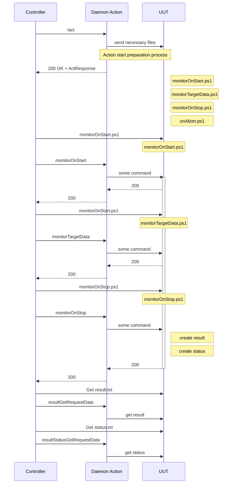

# v2.3.0

```mermaid
sequenceDiagram
    participant ctrl as Controller
    participant action as Daemon Action
    participant uut as UUT

    ctrl->>action: /act
    action->>uut: send necessary files
    Note over action, uut: Action start preparation process
    action-->>ctrl: 200 OK + ActResponse
    Note right of uut: monitorOnStart.ps1
    Note right of uut: monitorTargetData.ps1
    Note right of uut: monitorOnStop.ps1
    Note right of uut: onAbort.ps1

    ctrl->>uut: monitorOnStart.ps1
    Note over uut: monitorOnStart.ps1
    ctrl->>action: monitorOnStart
    action->>uut: some command
    activate uut
    uut-->>action: 200
    action-->>ctrl: 200

    ctrl->>uut: monitorOnStart.ps1
    Note over uut: monitorTargetData.ps1
    ctrl->>action: monitorTargetData
    action->>uut: some command
    uut-->>action: 200
    action-->>ctrl: 200

    ctrl->>uut: monitorOnStop.ps1
    Note over uut: monitorOnStop.ps1
    ctrl->>action: monitorOnStop
    action->>uut: some command
    Note right of uut: create result
    Note right of uut: create status
    uut-->>action: 200
    deactivate uut
    action-->>ctrl: 200

    ctrl->>uut: Get result.txt
    ctrl->>action: resultGetRequestData
    action->>uut: get result

    ctrl->>uut: Get status.txt
    ctrl->>action: resultStatusGetRequestData
    action->>uut: get status
```
